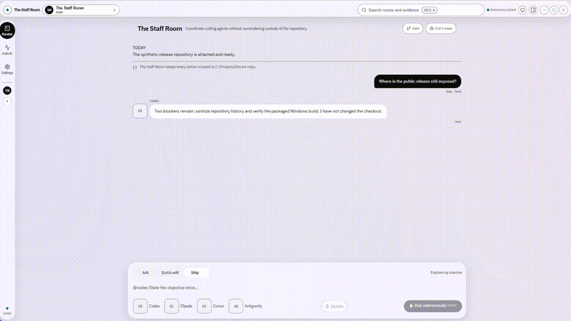
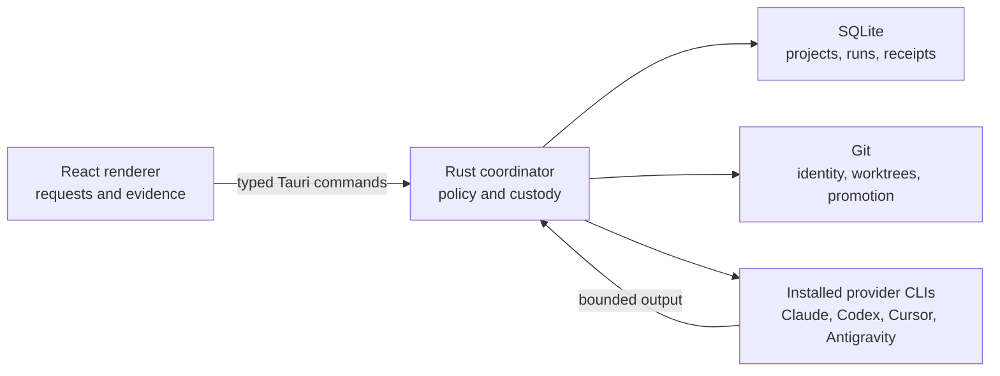

# The Staff Room

*A local-first Windows desktop staff room for your coding agents: they do the work, you decide what ships.*

**Application promotion gate:** Staff Room's Apply and Promote paths require review, native confirmation, and revalidated repository state. Git worktrees organize changes; they are not an operating-system containment boundary for installed provider executables.

Provider CLIs remain trusted programs. Command compatibility is checked against recorded versions and bounded help probes, separately from sign-in and live connection tests. Codex retains its provider-managed filesystem sandbox route. Claude and Cursor are read-only in Staff Room; their Quick Edit and Ship writes are disabled. Antigravity execution is disabled pending an enforceable boundary contract. Filesystem restrictions do not establish network or exfiltration isolation. See [provider boundary acceptance](docs/PROVIDER_BOUNDARY_ACCEPTANCE.md) for the supported matrix and outstanding native checks.



Historical v1 workflow demo, recorded before the provider boundary restrictions above: [watch the 1080p version](docs/assets/staff-room-demo.mp4).

The Staff Room is a Windows desktop application for working with installed Claude Code, Codex, Cursor, and Antigravity CLIs against an attached Git repository. Rust owns repository access, isolation, verification, and promotion. React renders the room; it does not hold the authority to bypass those controls.

## The safety model

- **Ask** is read-only and creates no worktree.
- **Quick Edit** works in a managed worktree. Staff Room applies its isolated diff to the attached checkout only after the user reviews the diff, presses **Apply**, and confirms in a native dialog. Rust rejects the operation if the isolated diff has changed since preview.
- **Ship** runs Build, Verify, and read-only Review in a managed worktree. If review or verification finds a problem, it performs at most one bounded Revision followed by Final Review. It stops at `awaiting-promotion` until the user presses **Promote** and confirms in a native dialog.
- **Autonomous Ship** remains locked. Its separate [acceptance contract](docs/AUTONOMOUS_ACCEPTANCE_CONTRACT.md) is public and still marked **NOT ACCEPTED**.
- **Voice** is local push-to-talk. A transcript is editable text only; it cannot send a message or authorize Apply, Promote, Discard, or Abandon.

## Architecture



The renderer can request an operation and display evidence. The Rust coordinator decides which repository is in scope, issues one-time operation leases, selects a provider mode, owns child-process limits, and revalidates Git state before promotion. See [the architecture and enforcement map](docs/ARCHITECTURE.md).

## Trust boundary

The important claims are traceable to code:

- [`project_repository`](src-tauri/src/db/projects.rs) reloads the attached project from SQLite and revalidates its canonical Git root.
- [`allocate_operation_id`](src-tauri/src/commands/projects.rs) issues a Rust-owned, one-use operation lease.
- [`ProviderMode::Probe` and `ProviderMode::Review`](src-tauri/src/providers/mod.rs) force non-writing provider routes for connection tests and review.
- [`approve_run_promotion`](src-tauri/src/commands/run.rs) owns the native confirmation prompt and requires a still-valid workspace fingerprint.
- [`active_promotions`](src-tauri/src/types.rs) prevents duplicate promotion of the same run.
- [`backup_v1_database`](src-tauri/src/db/projects.rs) creates and integrity-checks a consistent SQLite backup before the legacy schema migration.

Connection tests accept only an exact `READY` response. Provider claims do not decide completion; Git state, process results, verification commands, and review evidence do.

## Local voice

Voice is optional and offline. In Settings, select a trusted whisper.cpp `whisper-cli` executable and compatible ggml `.bin` model. The Staff Room copies both into local application data. Capture is capped at 30 seconds, transcription at two minutes, and the temporary WAV is removed after success, failure, or timeout.

Debug builds accept `STAFF_ROOM_WHISPER_CLI` and `STAFF_ROOM_WHISPER_MODEL`. Release builds require assets chosen through Settings, so an inherited environment variable or `PATH` entry cannot silently select an executable. See [the voice threat model](docs/VOICE.md).

## Build and run

Prerequisites:

- Windows 10 or 11 with WebView2
- Node.js 22 and npm
- Rust stable with the MSVC toolchain
- Visual Studio Build Tools with Desktop development with C++
- Git
- at least one supported provider CLI for live use; no provider is needed for the automated test suite

```powershell
npm ci
npm run tauri dev
```

For a frontend-only preview, run `npm run dev`. Browser preview never starts provider CLIs or microphone capture.

## Verify

```powershell
npm run check
```

The aggregate gate runs frontend tests and production build, design-token checks, Rust tests, and visual/accessibility QA without paid provider calls. Individual commands and the unsigned NSIS build are documented in [docs/BUILD.md](docs/BUILD.md).

## Release boundaries

- The current release supports Windows; macOS and Linux are not currently supported.
- Installed CLIs own model access and authentication.
- No cloud speech service or speech API key.
- No automatic Apply or Promote path.
- No accepted autonomous mode until its evidence contract passes.
- The installer is unsigned and Windows SmartScreen may warn.
- The current release is `1.0.0`. Its human-gated Windows workflow passed the packaged-app and live-provider observations in the [public release checklist](docs/PUBLIC_RELEASE_CHECKLIST.md). Autonomous Ship remains unavailable behind its separate evidence contract.

The source is available under the [MIT License](LICENSE). Security reports should follow [SECURITY.md](SECURITY.md).
