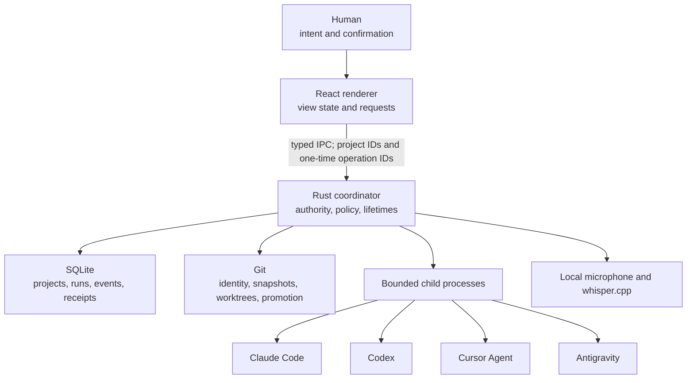

# Architecture and enforcement map

The Staff Room is a local Windows desktop application with a React 19 renderer, a Rust and Tauri 2 coordinator, SQLite state, Git-managed isolation, and adapters for installed coding-agent CLIs. The central design rule is that the renderer presents intent and evidence while Rust retains custody of repositories, processes, and promotion.

## System boundary

The renderer never supplies an authoritative repository path to a mutating command. It supplies a project ID and a Rust-issued operation ID. The coordinator reloads the stored project, canonicalizes its Git root, verifies the derived project identity, consumes the operation lease, and then chooses the relevant isolation and provider mode.

## Operation flows

### Ask

Ask consumes a project-bound chat operation ID and uses a provider adapter's read-only route. It does not create a managed worktree. The response is recorded in SQLite and returned to the renderer.

### Quick Edit

Quick Edit starts a managed worktree from the attached checkout's current `HEAD` and performs the requested work there. The resulting diff remains isolated until the user presses Apply and confirms in a native dialog. Apply proves the isolated diff still exactly matches the reviewed preview, then uses Git's patch check against the attached checkout before changing it; Discard removes the managed result.

### Ship

Ship owns a state machine across Build, Verify, Review, optional bounded Revision with post-revision Final Review, and `awaiting-promotion`. Review routes use `ProviderMode::Review` and a mutation guard. Verification and review evidence are persisted. Promotion begins only after a separate native confirmation owned by the Rust coordinator, serializes per project, and rechecks both the base checkout and reviewed worktree before applying the verified delta.

## Enforcement map

| Claim | Enforcing symbol | Location | Failure behavior |
| --- | --- | --- | --- |
| Repository identity is not renderer-controlled | `project_repository` | `src-tauri/src/db/projects.rs` | Rejects missing, non-Git, non-canonical, or identity-mismatched projects |
| Operations are one-use and project-bound | `allocate_operation_id`, `consume_operation_id` | `src-tauri/src/commands/projects.rs` | Removes the lease on use and rejects a reused or mismatched ID |
| Probe and review are non-writing modes | `ProviderMode::Probe`, `ProviderMode::Review`, `is_read_only` | `src-tauri/src/providers/mod.rs` and provider adapters | Adapter command construction fails closed when required capabilities are absent |
| Only exact connection proof is accepted | `connection_test_ready` | `src-tauri/src/providers/parse.rs` | Any response other than exact `READY` fails the probe |
| Provider work is time and output bounded | `PROCESS_TIMEOUT_SECONDS`, `PROCESS_IDLE_TIMEOUT_SECONDS`, `PROCESS_OUTPUT_LIMIT` | `src-tauri/src/types.rs`, `src-tauri/src/run/process.rs` | Terminates or fails the phase and records evidence |
| Reviewed content cannot silently change | `review_mutation_guard` | `src-tauri/src/git/isolation.rs`, `src-tauri/src/commands/run.rs` | Promotion is rejected when the reviewed fingerprint differs |
| Quick Edit applies only the reviewed preview | `require_reviewed_quick_edit` | `src-tauri/src/commands/edit.rs` | Apply is rejected if the isolated diff changed before or during native confirmation |
| Human confirmation gates Ship output | `approve_run_promotion` | `src-tauri/src/commands/run.rs` | Requires a native confirmation and a persisted run in `awaiting-promotion` |
| Promotion is serialized per project | `active_promotions` | `src-tauri/src/types.rs`, `src-tauri/src/commands/run.rs` | Rejects a second concurrent promotion |
| Legacy schema migration is recoverable | `backup_v1_database` | `src-tauri/src/db/projects.rs` | Requires an integrity-checked, atomically finalized backup |
| Product rename preserves pre-release local data | `prepare_app_data` | `src-tauri/src/db/app_data.rs` | Uses SQLite online backup, verifies `quick_check`, preserves the source, and refuses a corrupt copy |
| Autonomous mode is fail-closed | `AUTONOMOUS_ACCEPTANCE_COMPLETE` | `src-tauri/src/commands/projects.rs` | Remains `false`; the UI cannot arm the tier |

## Ownership and lifetime

- `RuntimeState` owns active operations, cancellations, provider cache entries, voice capture, Ship runs, Quick Edits, and promotion locks for the application process.
- SQLite owns durable project, run, message, event, provider-profile, and receipt state.
- Each provider turn, including Cursor session preallocation, starts suspended and is assigned to a Windows Job Object before execution. The turn then owns that descendant process tree, plus its output budget, idle timeout, total timeout, cancellation subscription, and artifact directory.
- Each Quick Edit or Ship run owns one managed isolation directory and its cleanup path.
- Rust microphone capture owns the stream and temporary WAV. Cleanup runs on success, failure, silence, and timeout.

## Data and compatibility

The public identifier is `com.staffroom.desktop`, with `staff-room.db` under the Tauri application-data directory. On first launch, `prepare_app_data` looks for the pre-release `com.agentroom.desktop/agent-room.db`, creates a consistent SQLite backup into the new location, runs `PRAGMA quick_check`, and copies known local voice assets without deleting or overwriting the source. Project-local memory now lives at `.staff-room/memory.md`; when that file is absent, the reader falls back to the pre-release `.agent-room/memory.md` without modifying the repository. The `ar-theme` browser-storage key remains a read-only compatibility fallback and new preferences are written to `staff-room-theme`.

No provider credential is stored by The Staff Room. Authentication remains owned by each installed CLI. Repository paths, prompts, provider output, and transcripts are local application data and should still be treated as sensitive.

## Deliberate limits

The public v1 does not claim a sandbox or complete descendant-process ownership for arbitrary verification commands, environment allowlisting, signed binaries, cross-platform support, or autonomous operation. Those gaps are not hidden behind a broad "experimental" label; the autonomous requirements are enumerated in [AUTONOMOUS_ACCEPTANCE_CONTRACT.md](AUTONOMOUS_ACCEPTANCE_CONTRACT.md).
