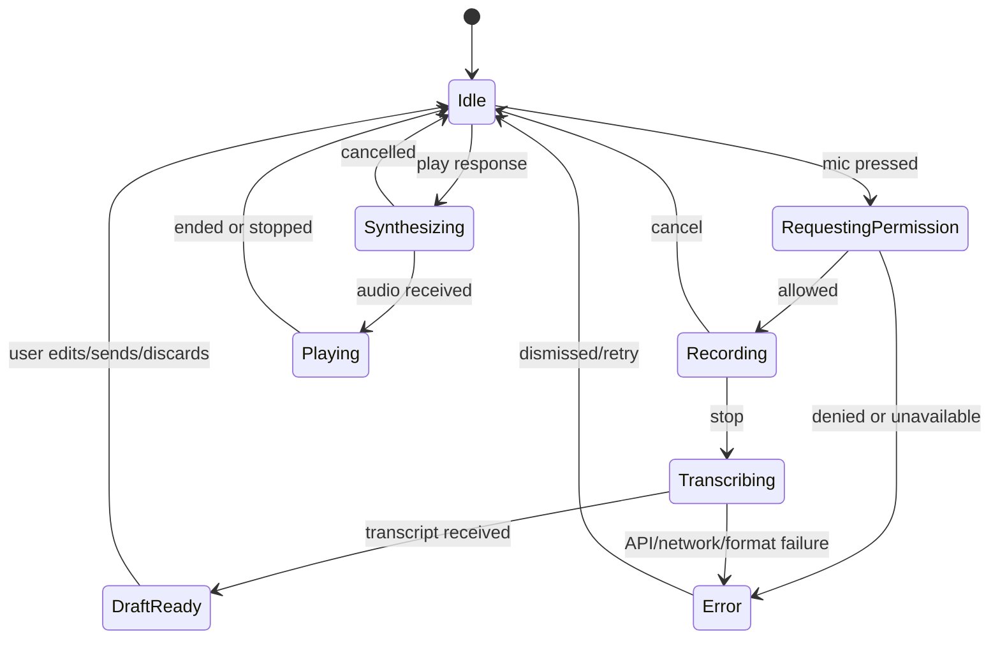

# Agent Room full project audit

**Audit date:** 28 July 2026
**Repository:** `<repo>`
**Branch inspected:** `redesign/liquid-glass`
**Scope:** product, market, frontend, accessibility, backend, provider adapters, security, data, Git isolation, process management, performance, testing, operations, packaging, documentation, and a proposed voice feature
**Verdict:** **Proceed, but do not release or use autonomous Ship on valuable repositories until the P0 safety and correctness gates are closed.**

## 1. Executive summary

Agent Room has a valuable core idea and some unusually thoughtful Git-preservation work. Its strongest product is not a generic multi-agent desktop room. That market is already crowded. Its plausible wedge is:

> One provider builds a change, a different provider independently reviews it, deterministic checks verify it, and Agent Room promotes only the reviewed delta into an unchanged local checkout, with durable evidence explaining why.

The current implementation does not yet earn that promise. The most important conclusions are:

1. **The product's own acceptance record says release acceptance failed.** `docs/V1_ACCEPTANCE.md:5` records that no desktop/provider end-to-end harness exists and most required observations were not performed. The current unit/build checks are green, but they do not prove the shipped workflow.
2. **Several trust boundaries are unsafe.** Renderer-controlled IDs become filesystem path components; mutation commands trust a caller-supplied repository path independently of the project ID; provider capabilities are granted from installation status rather than the documented live handshake; Git hooks and verification commands can execute repository code with the desktop user's authority.
3. **Autonomous execution is not actually confined on Windows.** A Git worktree protects Git state, not the operating system. Cursor Ship uses `--force` without a Windows sandbox, and verification commands run through a shell with inherited user authority.
4. **Core interface states are visibly broken.** The primitive stylesheet is not loaded; human message text has 1:1 foreground/background contrast; Quick Edit's Apply and Discard actions are trapped in a closed disclosure; the Inspector is not positioned as intended.
5. **Async state can cross project boundaries.** Switching projects during Chat or Quick Edit can allow responses, previews, or refreshes from project A to appear while project B is active.
6. **Antigravity is presented as Ship-capable but cannot become connected.** Its connection test always uses the Chat phase, which its adapter always rejects.
7. **Stop does not own the full child-process tree and there is no final cancellation check immediately before promotion.** Descendants may survive, and a late Stop can be acknowledged while promotion continues.
8. **Database migration and backup handling are not release-safe.** Migration errors are broadly discarded, and copying only the main SQLite file while using WAL mode can omit committed data.
9. **Voice is feasible for every supported agent.** The correct first architecture is app-level speech-to-text into the existing composer, followed by the existing provider route, with optional app-level text-to-speech for completed responses. No CLI adapter needs speech-specific logic.
10. **Voice is now expected parity, not the product wedge.** Current Codex desktop documentation already describes voice coordinating multiple agents. Agent Room should differentiate on cross-provider custody and verified promotion.

### Recommended release decision

- **Public release:** No.
- **Private development on disposable test repositories:** Yes, with known limitations.
- **Autonomous Ship on valuable repositories:** No, until path authority, repository binding, process isolation, review mode, verification trust, and cancellation/promotion gates are fixed.
- **Voice implementation:** Start only after the renderer/backend trust boundary and secret-handling foundation are fixed. Push-to-talk transcription can then be delivered without changing agent adapters.

## 2. Method and evidence

This audit combined:

- source inspection across the React/Vite frontend, Tauri/Rust backend, SQLite schema, provider adapters, Git isolation, tests, scripts, and product documents;
- direct build, unit, lint, dependency, and design checks;
- browser rendering and computed-style inspection in light and dark themes;
- parallel backend/security, frontend/UX, and product/operations reviews;
- current primary-source research for Tauri, SQLite, Git, Windows process containment, OpenAI voice APIs, WebView2 microphone permissions, and current direct alternatives.

### Evidence labels used

- **Observed:** directly present in source, configuration, test output, or rendered runtime.
- **Confirmed defect:** source and runtime evidence show the behavior is wrong.
- **Supported risk:** the code exposes a credible failure path, but the destructive outcome was not executed.
- **Unverified:** a required live/provider/packaged behavior could not be tested in this audit.

### Severity

| Priority | Meaning |
|---|---|
| P0 | Release blocker or repository/host safety blocker. Fix before autonomous use or distribution. |
| P1 | High-impact correctness, reliability, accessibility, or operational gap. Fix before public beta. |
| P2 | Important quality, scale, privacy, and maintainability work. Plan immediately after the beta gate. |
| P3 | Valuable polish or structural improvement that can follow once core contracts are stable. |

## 3. What the project is

Agent Room is a local-first Tauri desktop application with:

- a React 19 and Vite 6 renderer;
- a Rust/Tauri 2 coordinator;
- a SQLite database in WAL mode;
- CLI adapters for Codex, Claude Code, Cursor, and Antigravity;
- Ask, Quick Edit, and Ship routes;
- Git worktree or snapshot-clone isolation;
- provider handoffs, execution receipts, review phases, verification, recovery, and guarded promotion;
- a redesigned conversation-first interface.

The implementation is substantial. The main complexity concentrations are `src/App.tsx`, `src-tauri/src/run/mod.rs`, provider/runtime discovery, Git isolation, and database persistence.

## 4. Strengths worth preserving

The audit found important foundations that should not be lost during remediation:

- Clean-worktree promotion checks branch, HEAD, and cleanliness before fast-forwarding.
- Dirty checkouts preserve staged, unstaged, deleted, renamed, binary, and untracked state in existing test coverage.
- Snapshot-clone deletion validates the managed parent and `.git` marker before recursive removal.
- SQL queries are parameterized.
- Run-state updates and their transition event are transactionally coupled in `update_run`.
- Interrupted Ship runs are reconciled into a recoverable state.
- Provider prompts are passed through provider-specific process arguments or files, rather than interpolated into a shell command.
- Context and raw-output budgets exist, even though input allocation needs harder boundaries.
- The Tauri capability surface is small.
- No production `unsafe` Rust was found.
- The renderer centralizes native calls in `src/native.ts`.
- Agent-authored text is rendered through React text nodes without a raw HTML sink.
- The visual system has semantic color, spacing, type, dark-mode, reduced-motion, forced-colors, and reduced-transparency intent.
- Explicit older-message pagination preserves scroll position.

The remediation plan should evolve these foundations instead of replacing the application wholesale.

## 5. Release-blocking risk register

| ID | Priority | Finding | Consequence | Required gate |
|---|---:|---|---|---|
| SEC-01 | P0 | Renderer-controlled operation IDs become artifact/worktree path components | Path escape, collision, overwrite, stale-output reuse | Rust-generated UUIDs, normal-component validation, canonical containment, exclusive creation |
| SEC-02 | P0 | Project ID and repository path are independently trusted from IPC | Chat/edit/recovery/promotion can target the wrong repository | Resolve canonical repository only from persisted project ID |
| SEC-03 | P0 | Privileged WebView has `csp: null` | A future renderer injection reaches commands that spawn agents, Git, and shells | Strict production CSP and Tauri isolation review |
| SEC-04 | P0 | Git hooks and verification commands execute repository code as the desktop user | Attaching an untrusted repository can execute code outside provider isolation | Explicit repository trust, disabled coordinator hooks, approved verification plan, process sandbox |
| SEC-05 | P0 | Cursor Ship on Windows uses `--force` without OS confinement | Agent can affect files/processes outside the worktree | Disable unattended Cursor Ship on Windows or add real host sandboxing |
| RUN-01 | P0 | Stop kills only the direct child; final promotion lacks a last cancellation guard | Orphans, late mutation, false Stop acknowledgement | Job Objects/process groups, typed operation registry, atomic pre-promotion guard |
| RUN-02 | P0 | Review phases launch providers in write-capable Ship mode | Reviewer may mutate repository or host; current fingerprint can miss it | Dedicated read-only Review mode and content fingerprint |
| PROV-01 | P0 | Capabilities are inferred from “installed,” not verified flags/version | Unknown CLI versions are declared unattended-safe | Versioned live handshake, fail closed, invalidate on executable change |
| PROV-02 | P0 | Antigravity connection probe uses a phase the adapter rejects | Fresh install can never use Antigravity Ship | Provider-specific non-writing connection probe |
| DATA-01 | P0 | Migration errors are discarded; backup is not WAL-safe | Partial schema or incomplete backup presented as success | Versioned transactions and SQLite online backup/VACUUM INTO |
| UI-01 | P0 | `primitives.css` is never loaded | Main design system, overlays, controls, and accessibility fallbacks are absent | Load stylesheet after resolving overlay conflicts; computed-style gate |
| UI-02 | P0 | User messages have 1:1 text/background contrast | The primary conversation record hides what the user wrote | Inherit bubble foreground and add exact contrast assertions |
| UI-03 | P0 | Quick Edit Apply/Discard is inside an unreachable closed disclosure | Generated edit cannot be completed or cleared | Open review surface with explicit Apply/Discard state |
| UI-04 | P0 | Async Chat/Quick Edit state is not scoped to the active project | Project A results/actions can appear in project B | Key every action/event/state commit by project and run |
| QA-01 | P0 | Release acceptance is explicitly failed and no native/provider E2E gate exists | Green unit checks can coexist with broken production flows | Fake provider suite, native Tauri E2E, versioned live smoke matrix |
| OPS-01 | P0 | No CI or release pipeline exists | No reproducible merge or release gate | Windows-first CI, signed draft release pipeline, human promotion gate |

## 6. Security and trust-boundary audit

### SEC-01: Operation IDs are path authority

**Evidence**

- IPC requests contain caller-controlled run/edit IDs in `src-tauri/src/types.rs:198`, `:231`, and `:254`.
- `run_artifact_directory` appends `run_id` directly in `src-tauri/src/db/persistence.rs:366-374`.
- `src-tauri/src/run/process.rs:90-99` independently appends the same ID before writing prompt, stdout, stderr, and final-output files.
- Worktree naming removes hyphens but does not prove a single safe path component in `src-tauri/src/lib.rs:133` and `src-tauri/src/git/isolation.rs:67`.

**Supported risk**

Absolute paths, `..`, path separators, drive prefixes, collisions, or stale reused IDs can escape managed directories or overwrite fixed-name artifacts. This is particularly serious because the renderer is a WebView and the CSP is disabled.

**Implementation**

1. Generate `OperationId(Uuid)` in Rust for Chat, Quick Edit, Ship, connection tests, and recovery attempts.
2. Remove operation ID ownership from renderer mutation requests. Return the generated ID to the renderer.
3. Centralize `ManagedOperationPath::new(root, id)`:
   - parse an exact UUID;
   - require exactly one `Component::Normal`;
   - join under a canonical managed root;
   - verify the parent remains the root;
   - create the directory with exclusive semantics;
   - create output files with `create_new` or remove stale files before spawn.
4. Use typed namespaces so a Chat ID cannot replace a Ship cancellation sender.

**Verification**

- reject absolute paths, `..`, slashes, backslashes, drive prefixes, reserved Windows names, Unicode lookalikes, and duplicate IDs;
- assert no test input can create a file outside a temporary managed root;
- assert stale final output is never accepted.

### SEC-02: Bind project identity to one canonical repository

**Evidence**

- Chat trusts both caller `project_id` and caller `repository_path` in `src-tauri/src/commands/chat.rs:62-65`.
- Quick Edit uses the caller path in `src-tauri/src/commands/edit.rs:10-11`.
- Ship constructs its base repository from the caller path in `src-tauri/src/run/mod.rs:25`.
- Ship recovery queries by run ID only at `src-tauri/src/run/mod.rs:63-83`.
- A new Ship run can `INSERT OR IGNORE` a caller-selected project ID/path pair at `src-tauri/src/run/mod.rs:229-238`.
- Connection tests use the same split authority in `src-tauri/src/commands/providers.rs:563-564`.

**Implementation**

Create a single Rust-owned `ProjectContext`:

```text
ProjectContext {
  project_id,
  canonical_root,
  git_common_dir,
  active_branch,
  trust_state
}
```

Every mutation command should accept only `project_id` plus operation-specific data. It must load the attached project from SQLite and canonicalize/verify the persisted root. Recovery must query by both run and project, load the stored base/worktree identity, and prove the worktree remains inside the managed root and belongs to the same Git common directory.

**Verification**

- mismatched project/path pairs are impossible at the type/API layer;
- cross-project run recovery is rejected;
- symlink/junction changes after attach fail closed;
- a deleted/replaced repository requires reattachment.

### SEC-03: Restore a strict renderer security boundary

`src-tauri/tauri.conf.json:28` sets `csp` to `null`. Tauri's CSP guidance explains that CSP limits trusted content and helps mitigate XSS: [Tauri CSP guidance](https://v2.tauri.app/security/csp/).

**Implementation**

Start with a packaged-build policy equivalent to:

```text
default-src 'self';
script-src 'self';
style-src 'self' 'unsafe-inline';
font-src 'self';
img-src 'self' asset: data:;
connect-src ipc: http://ipc.localhost;
object-src 'none';
base-uri 'none';
frame-ancestors 'none';
```

The exact Tauri IPC origins must be validated against the generated production build. Do not allow remote scripts. Use the Rust core for secrets and network business logic. Consider Tauri's isolation pattern because this WebView can indirectly launch high-authority processes.

### SEC-04: Treat attached repositories as untrusted code

**Evidence**

- Git calls add `safe.directory` in `src-tauri/src/git/context.rs:3`.
- `git worktree add`, commit, and merge-related operations can invoke repository hooks.
- project detection chooses dependency preparation such as `npm ci`/`npm install` in `src-tauri/src/db/projects.rs:89`.
- verification executes stored text through `cmd /C` or `sh -lc` in `src-tauri/src/run/verification.rs:118-133`.
- processes inherit broad environment data; Codex explicitly uses `shell_environment_policy.inherit=all`.

Git worktrees isolate checkout state, not host execution. Git documents `safe.directory` as an ownership trust control and documents the hook execution points: [Git `safe.directory`](https://git-scm.com/docs/git-config.html), [Git hooks](https://git-scm.com/docs/githooks).

**Implementation**

1. Add an explicit repository trust screen before any command, hook, dependency install, or verification.
2. Stop force-trusting arbitrary directories. If an exception is required, scope it to the child command, canonical path, and approved project.
3. Run coordinator-owned Git with `core.hooksPath` set to an app-owned empty directory.
4. Show the exact prepare/check commands and their source before first execution.
5. Hash the approved verification plan and invalidate approval when it changes.
6. Prefer dependency preparation with lifecycle scripts disabled where workable.
7. Run verification in the same bounded process-tree and host sandbox as agents.
8. Pass a minimal environment allowlist, not the entire desktop environment.

### SEC-05: Use honest isolation labels

On Windows, `src-tauri/src/providers/cursor.rs:21-24` omits Cursor's sandbox but still uses `--force`. `src-tauri/src/providers/runtime.rs:224` labels the capability `isolated-auto`.

**Required decision**

- Disable autonomous Cursor Ship on Windows until a genuine OS sandbox exists, or
- require a separate high-risk confirmation that clearly says the process is not confined to the repository.

Longer term, implement a Windows containment boundary with a restricted token/AppContainer or another audited sandbox. A Job Object is necessary for process-tree ownership, but it is not by itself a filesystem/network sandbox.

### Other security/privacy work

- Restrict artifact directory permissions.
- Do not persist raw reasoning by default.
- Add retention, per-run deletion, and redacted diagnostic export.
- Cap every provider JSONL line, parsed field, array, and final-output file before allocation.
- Never expose OpenAI or provider API keys to React, localStorage, prompt artifacts, or ordinary SQLite tables.
- Add a secret/credential scan to CI without uploading repository content.

## 7. Provider and runtime audit

### PROV-01: Capability discovery contradicts the documented contract

`src-tauri/src/providers/runtime.rs:129` accepts help inputs but ignores them. Most capabilities are equivalent to `installed`. The probe at `:450` runs only `--version`. This contradicts the README/build-plan claim that required flags are verified from live help.

**Implementation**

Define a versioned adapter contract keyed by:

```text
provider + normalized version + executable path/hash + OS + adapter schema version
```

For each new key:

1. run `--version` under a short tree-killing timeout;
2. run the exact top-level and subcommand help probes needed by that adapter;
3. parse required flags and incompatible combinations;
4. run a non-writing handshake/smoke turn;
5. store signed/hashed evidence and timestamp;
6. fail closed to manual/read-only behavior if any required proof is absent.

Invalidate the record on executable/version/path/OS/adapter changes or invocation failures. Do not equate installation with permission safety.

### PROV-02: Antigravity is unreachable from a fresh database

`test_provider_connection` always invokes `Phase::Chat` and `ProviderMode::Ask` at `src-tauri/src/commands/providers.rs:594-607`. `src-tauri/src/providers/antigravity.rs:11-15` rejects every Chat phase. Ship admits only providers persisted as connected at `src-tauri/src/run/mod.rs:34-44`.

**Implementation**

Add `Phase::Connection` and `ProviderMode::Probe`, or a separate probe interface. Antigravity should use a verified, non-writing plan/sandbox command or official auth/status command. Persist connected only when the normalized complete response equals `READY`.

### Connection and probe hardening

- The current readiness match can accept `NOT READY`; require an exact normalized response.
- Provider discovery commands have no bounded process-tree timeout; add one.
- Bind connection evidence to the same executable/version identity as capabilities.
- Invalidate connected state when account, executable, version, or capability evidence changes.
- Make live-provider smoke tests opt-in and record provider version, date, OS, route, and observed capability.

### Review mode is not read-only

Both review phases use `ProviderMode::Ship` in `src-tauri/src/run/mod.rs:752` and `:1239`. That maps to:

- Codex `workspace-write`;
- Claude permission mode `auto`;
- Cursor `--force`.

The current mutation guard hashes HEAD and porcelain status, not full content, so changes to an already-dirty file or ignored file may evade it.

**Implementation**

- Add `ProviderMode::Review`.
- Map every provider to a verified read-only/planning invocation.
- Keep Antigravity in sandboxed plan mode.
- Fingerprint HEAD, index content, tracked worktree content, non-ignored untracked content, modes, and symlinks before and after review.
- Fail closed if the fingerprint cannot be computed.
- Continue preventing reviewers from promotion authority.

## 8. Run lifecycle, cancellation, Git, and recovery

### RUN-01: Own the process tree, not just the direct child

`child.kill()` is used for cancellation/timeouts in `src-tauri/src/run/process.rs` and verification. Provider shells and tools can spawn descendants that survive, hold pipes open, or continue mutation.

**Implementation**

- Windows: create each operation inside a Job Object with `JOB_OBJECT_LIMIT_KILL_ON_JOB_CLOSE`.
- Unix: create a separate process group/session and signal the group.
- Keep one typed operation registry that rejects occupied IDs.
- On cancellation: mark cancelling, close input, terminate the group, await/reap with a bounded grace period, force-kill remaining descendants, then persist the terminal state.
- Apply the same owner to provider probes and verification commands.

Microsoft documents Job Objects as a way to manage groups of processes: [Windows Job Objects](https://learn.microsoft.com/windows/win32/procthread/job-objects).

### RUN-02: Make promotion an atomic authority transition

There is no last cancellation check immediately before `promote_worktree` around `src-tauri/src/run/mod.rs:1475-1500`.

**Implementation**

1. Acquire a per-project promotion lock.
2. In one state transaction, prove:
   - the run is still eligible;
   - cancellation is not requested;
   - all child processes are reaped;
   - review and verification evidence matches the exact delta;
   - the base checkout fingerprint is unchanged.
3. Transition `ready_to_promote -> promoting`.
4. Revalidate the base repository under the same lock.
5. Apply/fast-forward.
6. Persist the promotion outcome and release the lock.

If Stop arrives after the irreversible boundary, report “promotion already started” rather than falsely confirming cancellation.

### Git and cleanup correctness

Additional work:

- Make Quick Edit return `{ applied: true, cleanupWarning }` if patch application succeeds but cleanup fails.
- Persist Quick Edit ownership so startup can reconcile abandoned worktrees.
- Make abandon cleanup idempotent with component-level progress.
- Recompute the base fingerprint after dirty-checkout snapshot creation to close the TOCTOU window.
- Treat diff/fingerprint failures as errors, not empty evidence.
- Persist each phase's message, receipt, handoff, activation, session, and state transition in one transaction.
- Use stable tie-breakers in latest-run/receipt queries.

## 9. Database and data lifecycle audit

### DATA-01: Replace best-effort migration with versioned migration

`src-tauri/src/db/schema.rs:224-265` discards every `ALTER TABLE` error. That can hide disk, corruption, syntax, or partial-schema failures. `src-tauri/src/db/projects.rs:170-187` copies only the main file although WAL is enabled at `src-tauri/src/db/schema.rs:7`.

SQLite documents its online backup interface and WAL persistence behavior: [SQLite online backup](https://www.sqlite.org/backup.html), [SQLite WAL](https://www.sqlite.org/wal.html).

**Implementation**

1. Add `PRAGMA user_version` or an explicit migrations ledger.
2. Use one ordered transaction per schema version.
3. Inspect schema state explicitly; tolerate only the exact expected prior state.
4. Back up through SQLite's online backup API or `VACUUM INTO`.
5. Record backup schema version and application version.
6. Run `PRAGMA quick_check` before and after migration.
7. Keep the timestamped backup until the new database opens and core queries pass.
8. Test upgrade fixtures from every supported released schema.

### Query, retention, and integrity improvements

- Add indexes for growing queries:
  - `runs(project_id, started_at DESC)`;
  - `execution_receipts(run_id, created_at)`;
  - `chat_receipts(project_id, created_at DESC)`;
  - `activations(run_id, state)`;
  - `handoffs(run_id, created_at)`;
  - message cursor ordering including a stable ID.
- Page cross-provider handoff from newest messages instead of loading all unseen messages before applying 4 KiB.
- Add `busy_timeout`, an explicit durability policy, and startup `quick_check`.
- Replace free-form run states with a Rust enum and database `CHECK` constraints.
- Stop replacing malformed stored JSON with empty values; surface a recoverable data error.
- Add independent retention policies for messages, prompts, raw outputs, receipts, logs, worktrees, and snapshots.
- Add “delete run artifacts” and “export redacted diagnostics.”

## 10. Frontend and UX audit

### UI-01: The primitive design system is not loaded

`src/components/primitives/index.ts` exports primitives but does not import `primitives.css`. The stylesheet owns Buttons, Chips, Segmented controls, Sheets, Monograms, Aurora, forced-colors, and reduced-motion rules.

**Runtime evidence**

- `.primitive-segmented` computed as block with a transparent background.
- `.primitive-monogram` remained an unbounded inline element.
- `.primitive-sheet-layer` computed as static.
- Browser-default route buttons and an unstyled context sheet were visible.

**Implementation**

Import `primitives.css` exactly once from the design entry point. First resolve the sheet overlay stack, because enabling the file introduces a sheet layer whose z-index currently conflicts with the separate Inspector scrim.

### UI-02: Human messages are unreadable in both themes

`src/components/conversation/conversation.css:12` gives outgoing bubbles `var(--action-ink)`, but `:20` resets descendant paragraphs to `var(--ink)`.

**Measured runtime values**

| Theme | Bubble background | Paragraph text | Contrast |
|---|---|---|---|
| Light | `rgb(12, 12, 14)` | `rgb(12, 12, 14)` | 1:1 |
| Dark | `rgb(244, 242, 247)` | `rgb(244, 242, 247)` | 1:1 |

The existing Axe pass did not catch this exact descendant/parent background pairing, which is why generic accessibility output cannot be the only visual gate.

**Implementation**

Use inherited foreground:

```css
.markdown-body {
  color: inherit;
}

.markdown-body p {
  color: inherit;
}
```

Give nested code/evidence elements explicit colors only when their own background changes. Add a computed-style contrast test for every visible text descendant against the actual painted bubble surface.

### UI-03: Quick Edit cannot be completed

`src/components/composer/Composer.tsx:144` places the preview inside a `Disclosure` without a summary or `defaultOpen`. `Disclosure` renders a closed `<details>`, while Apply and Discard are only inside the hidden content at `src/App.tsx:1804`.

**Implementation**

Render Quick Edit as a dedicated, open review surface with:

- changed-file summary;
- accessible diff;
- Apply and Discard buttons;
- per-action pending state;
- success, no-change, cleanup-warning, and retry states;
- project/run identity visibly bound to the preview.

### UI-04: Project switching crosses async boundaries

`activateProject` replaces project data without cancelling or scoping Chat, Quick Edit, activity, attention, settings, and event state. In-flight closures can later refresh or install data from the old project.

**Implementation**

Represent every async mutation as:

```text
RequestContext {
  projectId,
  operationId,
  kind,
  startedAt
}
```

Every event and state commit must match the current context. Native events should include `projectId`. Choose one explicit product behavior:

- disable project switching while Chat/Quick Edit mutates, while allowing background Ship to continue; or
- keep a separate state store per project.

Do not keep a global Quick Edit preview that can be applied after switching repositories.

### Other P1 frontend findings

1. **Stale event-listener project:** the one-time native listener captures the initially empty project ID. Route events by event project ID or an `activeProjectIdRef`.
2. **Chat run-ID race:** a complete event can enable a second submission before the first invoke settles; the first `finally` can clear the second run. Use a reducer keyed by run ID.
3. **Inspector positioning:** later `.glass { position: relative }` overrides `.inspector-sheet { position: fixed }`; duplicate Sheet/Inspector scrims and focus traps compete. Use low-specificity material rules and one overlay owner.
4. **Invalid typography shorthand:** declarations such as `font: var(--t-body)` omit a family and are discarded. Use complete shorthand or longhands.
5. **Composer accessibility:** add a durable label and implement the editable-combobox ARIA pattern for mentions.
6. **Live-region overload:** streaming bubbles, run cards, and nested activity regions all announce updates. Use one concise lifecycle live region and keep token streams non-live.
7. **Receipt ownership:** receipts are matched by time rather than run/phase. Serialize and join by `runId` plus phase/receipt ID.
8. **No native boot state:** detached Attach Project flashes before initialization, and failures only reach the console. Add `loading | ready | error` with retry.

### P2 frontend findings

- Search says “rooms and evidence” but searches only currently loaded in-memory message fields. Build native SQLite FTS with typed/paginated results, or rename it “Search loaded activity.”
- Timeline auto-scroll runs on every message/activity change and steals reading position. Follow only while near bottom and show “New activity” otherwise.
- Model catalogue refresh silently removes saved unavailable choices. Discovery must be read-only; require explicit replacement/save.
- Streaming maps and reparses the entire message history every animation frame. Flush at a measured interval, memoize completed groups, and isolate the active stream.
- Markdown rendering is safe but incomplete. If richer output is required, use an AST renderer with raw HTML disabled, an HTTP/HTTPS link allowlist, and explicit local-file actions.
- Settings reuse datalist IDs and lack per-action pending/success state.
- Two source strings contain mojibake: `ParticipantsTab.tsx` and `VerificationSettings.tsx`.

### P3 frontend structure

- Delete roughly 350 lines of commented legacy settings and the unused legacy Inspector from `src/App.tsx`.
- Split project lifecycle, event routing, Chat, Ship, Quick Edit, and provider settings into cohesive reducers/hooks.
- Enable `noUnusedLocals` and `noUnusedParameters` after removing dead code.
- Make System theme remove `data-theme` so subsequent OS theme changes continue to apply.
- Add full accessible names/current state to project buttons and complete Arrow/Home/End tab keyboard behavior.
- Audit font imports. The production build emits many separate font subset files; load only the scripts/weights actually required.

## 11. Accessibility acceptance

Accessibility needs a feature-level gate, not only a scanner.

Minimum beta checklist:

- outgoing and incoming message text, inline code, code blocks, receipts, and status colors meet WCAG contrast in both themes;
- all route, project, Inspector, Settings, Quick Edit, Stop, recovery, and voice actions are keyboard reachable;
- focus enters/restores correctly for one Sheet implementation;
- mentions follow the editable-combobox pattern;
- streaming produces concise start/final/failure announcements, not token-by-token speech;
- reduced motion disables smooth auto-scroll and decorative movement;
- forced colors keeps controls and state visible;
- Narrator or NVDA completes attach, Ask, Quick Edit review, Ship attention, and voice transcription flows;
- microphone state is never conveyed by color alone.

## 12. Performance and scale

### Current evidence

- `npm run build` produced about 297.5 kB JavaScript (89.77 kB gzip) and 59.3 kB CSS (12.27 kB gzip), plus many font assets.
- The project has explicit 500-message and 20 KiB response acceptance requirements, but the live acceptance document records them as unobserved.
- Message pagination exists, but no list virtualization is present.
- Provider output has aggregate caps, but a single line/final file can allocate before the cap is enforced.

### Improvements

1. Add a performance fixture with 500, 2,000, and 10,000 messages.
2. Measure startup, room load, search, scroll responsiveness, streaming commit count, and memory.
3. Virtualize only when measurement shows it is needed; first remove full-history reparsing and unnecessary state churn.
4. Stream provider output through a length-delimited bounded reader.
5. Cap JSON field sizes and final files before read/parse.
6. Add indexes based on measured query plans.
7. Trim font families/subsets and verify visual parity.
8. Record budgets in CI:
   - no long task over an agreed threshold during a 20 KiB stream;
   - stable scroll while user is not pinned to bottom;
   - bounded renderer and Rust memory for hostile output fixtures.

## 13. Test and QA audit

### Checks performed in this audit

| Check | Result |
|---|---|
| `npm test` | PASS: 3 files, 9 tests |
| `npm run build` | PASS |
| `cargo test --manifest-path src-tauri/Cargo.toml` | PASS: 48 tests |
| `cargo check --manifest-path src-tauri/Cargo.toml` | PASS |
| `cargo clippy --manifest-path src-tauri/Cargo.toml --all-targets -- -D warnings` | PASS |
| `cargo fmt --all -- --check` | PASS |
| `node scripts/check-design.mjs` | PASS: 78 files |
| `npm audit --json` | PASS: 0 known vulnerabilities across 167 dependencies |
| Existing visual QA report | 60 checks, 0 recorded failures/warnings |
| Direct light/dark computed message contrast | FAIL: 1:1 in both themes |
| Direct primitive/Inspector computed styles | FAIL |
| Rust advisory scan | NOT RUN: `cargo-audit`/`osv-scanner` unavailable |
| Live provider matrix | NOT RUN |
| Packaged desktop E2E | NOT RUN |
| Installer/update/signing test | NOT RUN |

The green visual report and failed direct render prove the current QA gate is insufficient.

### Required testing pyramid

#### Pure/unit tests

- safe operation ID and managed-path construction;
- project/repository binding;
- provider argv for every phase/mode/OS;
- exact handshake/capability parsing;
- run state reducer and cancellation transitions;
- migration steps and data validation;
- voice state machine, MIME/size/duration validation, and per-agent voice mapping.

#### Coordinator integration tests with fake CLIs

Create deterministic fake executables for all four providers. Support:

- valid/invalid version and help output;
- partial/malformed JSONL and oversized lines;
- session IDs and resumed turns;
- auth failure and quota output;
- controlled delays and timeouts;
- descendant processes holding stdout open;
- attempted review mutation;
- connection `READY` and `NOT READY`;
- cancellation before/between phases and immediately before promotion.

Run the real Rust coordinator against them without paid tokens.

#### Renderer integration tests

Use React Testing Library or equivalent with mocked Tauri IPC/events:

- project switch during every async operation;
- complete-before-invoke-resolution;
- Stop then immediate resubmit;
- Quick Edit review/apply/discard/retry;
- Inspector focus and layout;
- mention keyboard semantics;
- boot loading/error/retry;
- exact receipt-to-message ownership;
- voice record/transcribe/edit/send/cancel/play/stop.

#### Native desktop E2E

Use Tauri's current WebDriver route with WebdriverIO: [Tauri WebDriver testing](https://v2.tauri.app/develop/tests/webdriver/).

Required flows:

- fresh install and attach;
- migration from a packaged prior database;
- all fake-provider routes end to end;
- provider tree cancellation and force-close recovery;
- 500-message reload and long stream;
- both themes and supported window sizes;
- microphone allow/deny/no-device/hot-unplug on packaged Windows;
- installer launch and signed updater dry run.

#### Live-provider smoke

Run on demand or scheduled, not on every PR. Record:

- provider and CLI version;
- executable identity;
- OS;
- required help flags;
- auth status;
- Ask read-only proof;
- Quick Edit;
- Ship build/review/verification;
- cancellation/orphan result;
- timestamp and artifact hashes.

Only advertise support that has a recent recorded pass.

## 14. CI, dependencies, packaging, and release operations

### OPS-01: Add a Windows-first CI gate

There is no `.github/workflows` directory and no single CI command.

Recommended PR pipeline:

```text
checkout
  -> pin Node/npm and Rust
  -> npm ci
  -> npm test
  -> npm run build
  -> design checks
  -> cargo fmt --check
  -> cargo test --locked
  -> cargo clippy --locked --all-targets -- -D warnings
  -> fake-provider integration suite
  -> packaged Windows smoke
  -> archive redacted test evidence
```

Add Linux/macOS jobs only when those platforms have a tested provider/process contract. `targets: "all"` is not a substitute for support.

### Toolchain and dependency reproducibility

- `package-lock.json` and `Cargo.lock` are present, which is good.
- Add `packageManager`, Node `engines`, `.node-version`, and `rust-toolchain.toml`.
- Use `npm ci` and Cargo `--locked` in CI/releases.
- Update Tauri JavaScript packages, Rust crates, plugins, and CLI as one tested cohort.
- Add scheduled dependency PRs with full integration tests.
- Add RustSec, npm production audit, license review, and SBOM generation.

Current `npm outdated` showed major-version gaps:

| Package | Current | Latest observed |
|---|---:|---:|
| `@vitejs/plugin-react` | 4.7.0 | 6.0.4 |
| `lucide-react` | 0.468.0 | 1.27.0 |
| TypeScript | 5.7.3 | 7.0.2 |
| Vite | 6.4.3 | 8.1.5 |

Do not batch-upgrade these blindly. Open one compatibility branch per ecosystem cohort, read migration guides, run the full desktop suite, and measure bundle/behavior changes.

### Release pipeline

Before distribution:

1. Finalize publisher/legal name, identifier, support URL, privacy policy, and license/EULA.
2. Select Windows as the first honest target.
3. Choose and test one installer format.
4. Make one application version source and validate package/Cargo synchronization.
5. Sign binaries and installers.
6. Generate hashes, provenance, and an SBOM.
7. Upload a draft release.
8. Run human packaged acceptance.
9. Promote the release only after the acceptance record is complete.
10. Add signed updater support only after migration/rollback tests pass.

Tauri documents GitHub release pipelines, signing, and updater requirements: [Tauri GitHub pipeline](https://v2.tauri.app/distribute/pipelines/github/), [Windows signing](https://v2.tauri.app/distribute/sign/windows/), [Tauri updater](https://v2.tauri.app/plugin/updater/).

## 15. Observability, support, and data operations

Existing receipts are a good product primitive, but app operations are not yet supportable.

Add:

- structured local coordinator logs keyed by run ID, project hash, provider, phase, state, duration, and outcome;
- stable error codes and user actions;
- panic/crash capture that defaults to local storage;
- 7 to 14 day rotating app logs with a total disk cap;
- a separate raw provider artifact retention setting;
- Open run folder, Delete artifacts, and Export diagnostic bundle;
- a redaction preview before export;
- database schema/app/provider versions and `PRAGMA integrity_check` result in diagnostics;
- no prompt bodies, repository contents, absolute paths, environment variables, or tokens by default;
- opt-in remote telemetry only.

Suggested reliability metrics, stored locally by default:

- attach success/failure;
- provider probe duration/result;
- time to first provider text;
- run completion by phase;
- cancellation acknowledgement and full tree exit time;
- recovery and promotion results;
- migration duration/result;
- renderer crash/boot failure;
- voice transcript latency, first-audio latency, and failure code.

## 16. Product and market audit

### The generic category is already crowded

As of 28 July 2026:

| Alternative | Documented capability | Product implication |
|---|---|---|
| [Emdash](https://emdash.ai/docs) | Cross-platform desktop, many CLI agents, worktrees, diffs, automations, issue/remote/CI integrations | “Multi-provider desktop manager” is not a wedge |
| [Conductor](https://www.conductor.build/docs) | Multiple provider CLIs, isolated workspaces, terminals, diffs, PR/check/review flows | Worktree and review UX are expected |
| [Conductor parallel agents](https://www.conductor.build/docs/concepts/parallel-agents) | Implementer/reviewer/test-repair patterns | Builder plus reviewer needs a stronger custody claim |
| [Superset](https://docs.superset.sh/overview) | Local-first, open-source, agent-agnostic worktrees and persistent terminals | Local-first and agent-agnostic are not unique |
| [Claude Code parallel agents](https://code.claude.com/docs/en/agents) | Subagents, agent view, agent teams, worktrees, batch work | Same-provider orchestration is becoming native |
| [Claude Code worktrees](https://code.claude.com/docs/en/worktrees) | Desktop/CLI worktrees and subagent isolation | Worktree lifecycle is a platform primitive |
| [Codex app](https://openai.com/index/introducing-the-codex-app/) | Multi-agent desktop, threads, worktrees, skills, review | Parallel agent supervision is provider-native |
| [Cursor Background Agents](https://docs.cursor.com/background-agent) | Asynchronous agents in isolated remote machines | Isolation and async execution are expected |
| [GitHub Copilot custom agents](https://docs.github.com/en/copilot/concepts/agents/cloud-agent/about-custom-agents) | Specialized agents with prompts, tools, and MCP | Configurable agent roles are commoditizing |
| [Agent Deck](https://github.com/asheshgoplani/agent-deck) | Provider-agnostic TUI, worktrees, hooks, sparse checkout, Docker sandbox | A free terminal substitute covers much mechanics |

### Recommended position

Use this product sentence:

> Agent Room lets one local coding agent build a change and a different agent independently review it. It runs repository checks and applies only the reviewed delta when the original checkout is unchanged.

Core verb: **cross-check and promote**
Core object: **a verified, reviewed change**
Best initial customer: a solo developer or small team already paying for two coding agents and manually relaying context, diffs, and test evidence.

Do not lead with:

- “rooms”;
- provider count;
- parallel swarms;
- generic worktrees;
- generic local-first;
- IDE replacement;
- voice.

### Validate the wedge before expanding

Run a benchmark on 30 representative changes:

1. single-provider completion;
2. same-provider review;
3. cross-provider review;
4. deterministic verification;
5. guarded promotion.

Measure:

- consequential defects introduced;
- defects caught before promotion;
- false-positive review objections;
- completion and human-review time;
- provider cost/usage;
- recovery/cancellation reliability;
- whether provider diversity adds measurable value.

Pair it with 10 interviews with developers using at least two agent subscriptions. The key unknown is whether extra defect detection and custody confidence justify added latency and usage.

## 17. Voice feature feasibility and decision

### Short answer

**Yes. Voice can be added for the user and can work with every existing agent.**

The recommended first implementation does not make Codex, Claude, Cursor, or Antigravity “speak APIs.” It adds voice at the Agent Room boundary:

```mermaid
flowchart LR
    Mic["Microphone"] --> Capture["Tauri/WebView capture"]
    Capture --> STT["Speech-to-text"]
    STT --> Draft["Editable composer text"]
    Draft --> Router["Existing Ask / Quick Edit / Ship route"]
    Router --> CLI["Existing provider CLI adapter"]
    CLI --> Text["Existing streamed text response"]
    Text --> Projection["Speakable response projection"]
    Projection --> TTS["Text-to-speech"]
    TTS --> Speaker["Speaker"]
```



This means:

- voice input targets whichever agent/route the composer already selects;
- all four adapters receive ordinary text and need no voice-specific flags;
- TTS is an application output transport with optional per-agent voice mapping;
- Antigravity remains Ship-only;
- written receipts, permissions, verification, and promotion remain authoritative;
- spoken output never expands agent authority.

### Why chained voice first

OpenAI's current voice-agent guidance distinguishes:

- a chained architecture: speech-to-text, existing text agent, then text-to-speech;
- realtime speech-to-speech for low-latency natural conversation and interruption.

The guidance recommends chaining when extending an existing text agent, retaining transcripts, and preserving predictable workflows: [OpenAI voice agents guide](https://developers.openai.com/api/docs/guides/voice-agents).

Agent Room is approval-heavy and already has four text CLI integrations. Chaining therefore has the best correctness boundary:

- the user sees and can edit the transcript;
- the exact text sent to the CLI is auditable;
- the existing provider and Ship logic is unchanged;
- TTS can speak a safe projection of the final answer without altering written evidence;
- cost, privacy, failure, and cancellation are easier to explain.

### Current competitive implication

OpenAI's current desktop help says Voice in Work or Codex can start, prioritize, interrupt, redirect, and coordinate work across multiple agents on macOS and Windows: [ChatGPT Voice](https://help.openai.com/en/articles/20001274), [Work and Codex voice](https://help.openai.com/en/articles/20001275-chatgpt-work-and-codex).

Voice is therefore table stakes and an accessibility/input-speed feature. The differentiation remains cross-provider custody.

## 18. Voice implementation design

### Phase V0: prerequisites

Do this before sending any audio:

1. Restore a strict CSP.
2. Keep network calls and API keys in Rust.
3. Add explicit first-use microphone consent and privacy copy.
4. Prove microphone capture in a packaged Windows WebView2 build.
5. Define transcript/raw-audio retention.
6. Add an app-level voice state machine and interruption policy.
7. Decide account model:
   - first release: user supplies an OpenAI API key to Rust via environment or an OS-backed secret store;
   - later: product-managed service with authentication, budgets, abuse controls, and a privacy policy.

Codex CLI login is not an OpenAI API key and should not be reused as one.

### Phase V1: push-to-talk transcription for all agents

**User flow**

1. User presses and holds or toggles the microphone.
2. A persistent recording indicator and timer appear.
3. Release/Stop ends capture.
4. Audio is sent to the Rust transcription command.
5. Transcript is inserted into the composer as editable text.
6. User reviews and explicitly sends it.

Do not auto-submit in the first release.

**Frontend integration**

- `src/components/composer/Composer.tsx`
  - add microphone button beside the send action;
  - use `navigator.mediaDevices.getUserMedia({ audio: true })`;
  - use `MediaRecorder` where supported;
  - expose recording, processing, error, and cancel states;
  - tear down tracks on completion, route change, unmount, and error;
  - Stop voice playback when recording starts.
- `src/App.tsx`
  - own voice state through an extracted reducer/hook, not more monolithic booleans;
  - feed the completed transcript into the current composer draft;
  - preserve the existing `submitChat`/Quick Edit/Ship functions.
- `src/model.ts`
  - add `VoiceSettings`, `VoiceCaptureState`, `VoicePlaybackState`, and typed error codes.
- `src/native.ts`
  - add typed `transcribeAudio` and settings wrappers.

**Rust integration**

- add `src-tauri/src/commands/voice.rs`;
- add `src-tauri/src/voice/mod.rs` and `voice/openai.rs`;
- register commands and a reusable Rust HTTP client in `lib.rs`;
- validate MIME, duration, byte size, selected model, and request timeout;
- send multipart audio to the transcription endpoint using Rustls;
- return typed text/language/duration metadata;
- accept raw binary IPC rather than JSON/base64 where practical.

Tauri supports raw `InvokeBody` and binary `Response` patterns: [Calling Rust from Tauri](https://v2.tauri.app/develop/calling-rust/).

**Initial model**

Use `gpt-4o-mini-transcribe` for the default cost/quality path. Offer `gpt-4o-transcribe` only when measured accuracy justifies it. Official speech-to-text guidance: [OpenAI speech-to-text](https://developers.openai.com/api/docs/guides/speech-to-text).

### Phase V2: optional speech output

Add Play, Stop, and Replay to completed agent messages. Auto-speak must be opt-in and off by default.

**Rules**

- Speak only completed response prose at first, not unstable token deltas.
- Do not read code blocks, logs, long diffs, absolute paths, secrets, raw receipts, or stack traces by default.
- Generate a “speakable projection” that leaves the written answer untouched.
- Share one playback queue across agents.
- Map a stable voice to each `AgentKind` in settings.
- Stop and invalidate pending audio when the user records again or chooses Stop.
- Do not let ambient voice cancellation stop an active Ship run.

**Implementation**

- Rust calls `gpt-4o-mini-tts`.
- Request WAV or PCM for low decode overhead.
- Return binary audio through Tauri IPC.
- Use a generation ID so late TTS responses cannot start after cancellation.
- Cache only in memory initially.
- Add Play/Stop/Replay controls in `MessageGroup.tsx`.
- Add a Voice settings section with enablement, auto-speak, rate, selected transcription model, per-agent voice, and test controls.

OpenAI requires clear disclosure that a TTS voice is AI-generated: [OpenAI text-to-speech](https://developers.openai.com/api/docs/guides/text-to-speech).

### Phase V3: streaming and deliberate interruption

After V1/V2 meet latency and reliability targets:

- stream transcription for long dictation;
- stream completed sentence chunks to TTS;
- allow explicit interruption of active Ask only after Stop is acknowledged;
- keep Quick Edit/Ship interruption as an explicit high-consequence action;
- add VAD only as a user-controlled mode;
- record item/generation IDs for exact cancellation.

### Phase V4: optional realtime concierge

Only build this if measured latency shows chained voice is inadequate.

A realtime voice model could become a concierge that:

- understands spoken commands;
- queries Agent Room state;
- starts or redirects existing text-agent operations as tools;
- speaks progress and completion.

Do not replace provider CLIs with the realtime model. It would add another model with its own interpretation, permission, cost, and paraphrasing boundary. Every modifying action still needs the same explicit authorization and custody pipeline.

If WebRTC is used, the standard API key remains on the Rust/backend side. The client receives only a short-lived ephemeral secret or uses a backend-created session: [OpenAI Realtime WebRTC](https://developers.openai.com/api/docs/guides/realtime-webrtc).

### Voice state machine



Every async completion must carry a generation ID. A result from an old generation is discarded.

### Secret and data handling

- Never store an API key in React, localStorage, ordinary settings JSON, prompt files, run artifacts, or logs.
- First release: read a Rust-side environment variable, or use an OS-backed secret store such as Tauri Stronghold after a threat-model review: [Tauri Stronghold](https://v2.tauri.app/reference/javascript/stronghold/).
- Keep raw audio in memory and delete buffers immediately after transcription/playback.
- Store the transcript only when the user sends it as a normal message.
- Explain that sent transcripts become room history and may enter bounded handoff context.
- Keep TTS audio memory-only initially.
- Do not log audio, transcript bodies, request multipart data, or API responses containing user text.
- Add per-run voice metrics without content.
- Do not offer voice cloning initially. Custom voices have eligibility and consent requirements.

OpenAI data-control documentation should be checked against the chosen account and region immediately before release: [OpenAI data controls](https://developers.openai.com/api/docs/guides/your-data).

### Windows feasibility

Tauri uses WebView2 on Windows. WebView2 has a microphone permission kind, and `getUserMedia` requires a secure context and explicit permission: [WebView2 permission kinds](https://learn.microsoft.com/en-us/microsoft-edge/webview2/reference/winrt/microsoft_web_webview2_core/corewebview2permissionkind), [MDN `getUserMedia`](https://developer.mozilla.org/en-US/docs/Web/API/MediaDevices/getUserMedia).

The browser API approach is appropriate, but feasibility must be proven in the packaged application, not inferred from Vite/Chrome development mode.

Test:

- first permission allow and deny;
- permanent deny and OS settings recovery;
- no microphone;
- device unplug during recording;
- Bluetooth input switching;
- app background/minimize;
- offline and API timeout;
- oversized/zero-length capture;
- rapid record/cancel/re-record;
- autoplay restrictions;
- sleep/resume.

Use a native capture library such as `cpal` only if WebView2 behavior proves inadequate. Native capture raises its own device, codec, packaging, and thread-lifetime complexity.

### Accessibility and user control

- Persistent red recording indicator plus text and timer.
- Microphone state announced once through a dedicated live region.
- Keyboard shortcut configurable and non-conflicting.
- Escape cancels recording without sending.
- Transcript is editable and focus returns to the composer.
- Clear error for permission denied, no device, network, size, format, quota, and service failure.
- Never auto-start the microphone.
- Auto-speak off by default to avoid duplicating screen-reader announcements.
- AI-generated voice disclosure in onboarding/settings.

### Current indicative API cost

Official pricing observed on 28 July 2026:

| Capability | Model | Indicative price |
|---|---|---:|
| Transcription | `gpt-4o-mini-transcribe` | $0.003/minute |
| Transcription | `gpt-4o-transcribe` | $0.006/minute |
| Realtime transcription | `gpt-realtime-whisper` | $0.017/minute |
| TTS | `gpt-4o-mini-tts` | $0.60/1M text input tokens and $12/1M audio output tokens |
| Realtime audio | realtime 2.1 | $32/1M audio input tokens and $64/1M audio output tokens |
| Realtime audio | realtime 2.1 mini | $10/1M audio input tokens and $20/1M audio output tokens |

Source: [OpenAI API pricing](https://developers.openai.com/api/docs/pricing). Pricing and model availability are time-sensitive and must be rechecked before implementation/release.

### Voice acceptance criteria

V1 is complete only when:

- every supported agent/route receives the exact reviewed transcript text;
- raw audio and the API key never appear in SQLite, logs, prompts, or run artifacts;
- microphone tracks are released on every exit path;
- denial/no-device/offline/timeout/cancel flows recover without restart;
- switching project or route cannot install an old transcript;
- recording stops audio playback but never silently stops Ship;
- every spoken response has a visible equivalent;
- AI voice disclosure is present;
- packaged Windows tests pass;
- measured median and p95 transcript latency are recorded;
- cost/usage is visible or budgeted.

## 19. Documentation audit

The repository does not present one trustworthy current state:

- README describes a broad working v1.
- `docs/V1_ACCEPTANCE.md` says release acceptance failed.
- acceptance test counts are stale compared with the current 9 frontend and 48 Rust tests.
- older build/resume/redesign documents describe obsolete states.
- provider support claims are not generated from recorded live evidence.

Recommended documentation set:

- `README.md`: outcome, current release status, screenshot, prerequisites, five-minute start, supported/tested provider matrix, limits, privacy/data locations, verification, and support;
- `docs/architecture.md`;
- `docs/security-model.md`;
- `docs/development.md`;
- `docs/testing.md`;
- `docs/releasing.md`;
- `docs/troubleshooting.md`;
- `docs/privacy-and-data.md`;
- `CHANGELOG.md`;
- `SECURITY.md`;
- license/EULA and `CONTRIBUTING.md` if appropriate.

Archive historical plans under a dated `docs/archive/` label rather than presenting them beside current contracts. Generate one provider support matrix from acceptance evidence. State “tested with version X on date Y,” not permanent compatibility.

## 20. Implementation roadmap

The order below follows dependencies. Voice starts only when its security foundation exists.

### Gate A: freeze unsafe autonomy

**Outcome:** no path can claim unattended safety without proof.

- disable or prominently gate autonomous Cursor Ship on Windows;
- mark release status as pre-release and acceptance failed;
- make Antigravity unavailable until its probe is fixed;
- remove unsupported provider capability claims;
- document that worktrees are not an OS sandbox.

### Gate B: repair authority boundaries

**Outcome:** renderer data cannot select host paths or repositories.

- Rust-generated typed operation IDs;
- canonical managed-path helper;
- Rust-loaded `ProjectContext`;
- run/project-bound recovery;
- strict CSP;
- explicit repository trust;
- coordinator Git hooks disabled;
- minimal environment policy.

### Gate C: make execution and promotion atomic

**Outcome:** Stop, review, verification, and promotion have honest boundaries.

- process groups/Windows Job Objects;
- typed operation registry;
- dedicated read-only Review mode;
- full content fingerprint;
- approved/sandboxed verification plan;
- cancellation guard immediately before promotion;
- per-project promotion lock and state transaction;
- idempotent Quick Edit/abandon cleanup.

### Gate D: make provider and data contracts versioned

**Outcome:** provider and database compatibility are evidence-based.

- real version/help/handshake capability cache;
- provider-specific connection probes;
- exact readiness matching;
- versioned transactional migrations;
- WAL-safe backup and restore tests;
- bounded parser/file inputs;
- phase-level persistence transactions and indexes.

### Gate E: restore the interface

**Outcome:** the main workflows are usable and project-safe.

- load primitive styles and repair overlay ownership;
- fix outgoing message contrast;
- expose Quick Edit review actions;
- key all async state/events by project/run;
- fix event listener/run-ID races;
- fix Inspector geometry, typography, composer semantics, and live regions;
- add native boot/error state;
- stop scroll theft and catalogue auto-mutation.

### Gate F: install executable acceptance

**Outcome:** the release claim is generated by tests, not prose.

- fake CLIs for four providers;
- coordinator integration suite;
- renderer interaction suite;
- packaged Windows Tauri E2E;
- CI;
- live versioned provider smoke;
- complete the 29-row acceptance record;
- signed draft installer and migration/update rehearsal.

### Gate G: voice V1 and V2

**Outcome:** voice reaches every agent without weakening custody.

- packaged microphone feasibility;
- Rust-only STT key/network boundary;
- editable push-to-talk transcript;
- all-provider routing tests;
- optional final-response TTS;
- per-agent voice mapping;
- privacy, disclosure, retention, latency, and budget controls.

### Gate H: product proof

**Outcome:** evidence supports the wedge.

- 30-task single/same-provider/cross-provider benchmark;
- 10 target-user interviews;
- compact custody receipt;
- rewrite product positioning;
- decide whether realtime concierge and wider platforms are justified.

### Suggested pull-request sequence

Keep each change independently reviewable. Do not combine the security boundary, database migration, UI redesign, and voice work into one rewrite.

| PR | Scope | Required proof before merge |
|---:|---|---|
| 1 | Truthful pre-release state: disable unsafe unattended paths, correct capability/support copy, preserve failed acceptance status | UI and docs show the same support matrix; no unsupported provider can start |
| 2 | Rust-owned operation IDs, managed-path helper, typed operation registry | traversal/collision property tests; no artifact outside temp managed root |
| 3 | Persisted `ProjectContext`, remove mutation `repository_path`, project-bound recovery | cross-project/mismatched/symlink tests |
| 4 | CSP, repository trust, empty coordinator hooks path, minimal environment | packaged CSP smoke; malicious hook fixture cannot execute |
| 5 | Job Objects/process groups and atomic cancellation/promotion gate | descendant-process and late-Stop integration tests |
| 6 | Read-only Review mode, full content fingerprint, approved verification plan | golden argv and same-porcelain content-mutation tests |
| 7 | Versioned provider handshake, exact readiness, timeouts, Antigravity probe | all fake providers transition through supported states |
| 8 | Transactional migrations and WAL-safe backups | fixture upgrade/restore and failure-injection suite |
| 9 | Primitive CSS, outgoing contrast, Quick Edit surface, Inspector ownership | computed-style, contrast, keyboard, and visual captures |
| 10 | Project/run-scoped frontend reducer and event router | deferred-operation A-to-B switching and run-order tests |
| 11 | Fake CLI harness, renderer tests, Windows CI, packaged E2E | acceptance flows pass without provider tokens |
| 12 | Signed draft release, migration/update rehearsal, current live provider smoke | complete acceptance record and human release approval |
| 13 | Voice V0/V1: Rust secret/network boundary and editable transcription | packaged Windows microphone matrix and no-content-leak tests |
| 14 | Voice V2: safe speech projection and manual playback | interruption, accessibility, per-agent mapping, and latency/cost evidence |

## 21. Definition of beta-ready

Agent Room is beta-ready when all of the following are true:

1. No renderer-controlled value can escape a managed path or select an unbound repository.
2. Every unattended provider capability is bound to current executable/version/OS evidence.
3. Review is read-only and verification/repository code runs inside an explicit trust/sandbox boundary.
4. Stop terminates the full process tree and cannot race silently with promotion.
5. Migration is versioned, transactional, backed up correctly, and tested from every released schema.
6. Human messages, Quick Edit, Inspector, project switching, Chat event order, and core accessibility flows pass packaged E2E.
7. Fake-provider end-to-end tests cover every phase and failure state.
8. The documented provider matrix matches recent live smoke evidence.
9. The 29 acceptance rows are rerun and truthfully pass or are explicitly removed from scope.
10. A signed Windows installer is produced reproducibly, with support/privacy/recovery documentation.
11. If voice ships, its separate acceptance criteria are met.

## 22. Audit limitations

This audit did not:

- run paid/authenticated live provider turns;
- execute destructive path traversal or host escape attempts;
- run a packaged Tauri desktop E2E harness, because none exists;
- install or run `cargo-audit`/`osv-scanner`;
- test code signing, installer upgrade, updater, or rollback;
- test actual microphone permission in the packaged app;
- validate API availability/pricing beyond current official documentation.

Those are missing evidence, not evidence of success.

Two pre-existing user changes were left untouched:

- `docs/redesign/.state.json`
- `docs/redesign/REPORT.md`

This audit adds only this report.

## 23. Primary research references

### Voice and Tauri

- [OpenAI voice agents](https://developers.openai.com/api/docs/guides/voice-agents)
- [OpenAI speech-to-text](https://developers.openai.com/api/docs/guides/speech-to-text)
- [OpenAI text-to-speech](https://developers.openai.com/api/docs/guides/text-to-speech)
- [OpenAI Realtime WebRTC](https://developers.openai.com/api/docs/guides/realtime-webrtc)
- [OpenAI API pricing](https://developers.openai.com/api/docs/pricing)
- [OpenAI data controls](https://developers.openai.com/api/docs/guides/your-data)
- [ChatGPT Voice](https://help.openai.com/en/articles/20001274)
- [Voice with Work and Codex](https://help.openai.com/en/articles/20001275-chatgpt-work-and-codex)
- [Tauri CSP](https://v2.tauri.app/security/csp/)
- [Tauri process model](https://v2.tauri.app/concept/process-model/)
- [Tauri binary IPC](https://v2.tauri.app/develop/calling-rust/)
- [Tauri Stronghold](https://v2.tauri.app/reference/javascript/stronghold/)
- [WebView2 microphone permission](https://learn.microsoft.com/en-us/microsoft-edge/webview2/reference/winrt/microsoft_web_webview2_core/corewebview2permissionkind)
- [MDN `getUserMedia`](https://developer.mozilla.org/en-US/docs/Web/API/MediaDevices/getUserMedia)

### Runtime, data, and release

- [Git `safe.directory`](https://git-scm.com/docs/git-config.html)
- [Git hooks](https://git-scm.com/docs/githooks)
- [SQLite online backup](https://www.sqlite.org/backup.html)
- [SQLite WAL](https://www.sqlite.org/wal.html)
- [Windows Job Objects](https://learn.microsoft.com/windows/win32/procthread/job-objects)
- [Tokio process behavior](https://docs.rs/tokio/latest/tokio/process/)
- [npm lifecycle-script controls](https://docs.npmjs.com/cli/v11/commands/npm-ci/)
- [Tauri WebDriver testing](https://v2.tauri.app/develop/tests/webdriver/)
- [Tauri GitHub pipeline](https://v2.tauri.app/distribute/pipelines/github/)
- [Tauri Windows signing](https://v2.tauri.app/distribute/sign/windows/)
- [Tauri updater](https://v2.tauri.app/plugin/updater/)

### Current alternatives

- [Emdash](https://emdash.ai/docs)
- [Conductor](https://www.conductor.build/docs)
- [Superset](https://docs.superset.sh/overview)
- [Claude Code parallel agents](https://code.claude.com/docs/en/agents)
- [Claude Code agent teams](https://code.claude.com/docs/en/agent-teams)
- [Claude Code worktrees](https://code.claude.com/docs/en/worktrees)
- [Codex app](https://openai.com/index/introducing-the-codex-app/)
- [Cursor Background Agents](https://docs.cursor.com/background-agent)
- [GitHub Copilot custom agents](https://docs.github.com/en/copilot/concepts/agents/cloud-agent/about-custom-agents)
- [Agent Deck](https://github.com/asheshgoplani/agent-deck)
